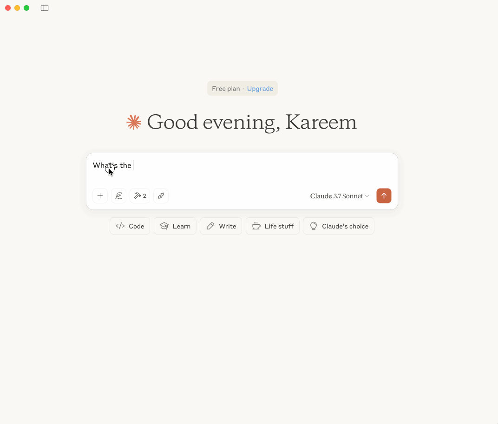

# Network Assistant — MCP Server for Network Engineers

This project sets up a [Model Context Protocol (MCP)](https://modelcontextprotocol.io) server designed specifically for **network engineers**.  
It allows Claude for Desktop (or other LLM clients) to access structured knowledge about your network — such as routing policies and device health — via simple tools.

## 🧠 Prerequisite Knowledge

This quickstart assumes you're familiar with:
- Python
- LLMs like Claude

## 💻 System Requirements

- Python **3.10 or higher**
- MCP Python SDK **v1.2.0 or newer**

## ⚙️ Set Up Your Environment

### 1. Install `uv`

MacOS/Linux:

    brew install uv

> 🔁 Restart your terminal to ensure the `uv` command is available.

### 2. Set Up Your Project

    uv init

    uv venv
    source .venv/bin/activate # or .venv\Scripts\activate on Windows

    uv add "mcp[cli]"

## ▶️ Run Your Server

    python network_assistant.py

This launches your MCP server over `stdio`, ready to connect to Claude.

## 🧪 Test with Claude for Desktop

> Claude for Desktop is currently only available on macOS and Windows.
1. Download Claude for Desktop from [here](https://www.anthropic.com/download).
2. Open your Claude Desktop app.
3. Configure the MCP server in:
   - `~/Library/Application Support/Claude/claude_desktop_config.json` (macOS)
   - `C:\Users\<YOU>\AppData\Roaming\Claude\claude_desktop_config.json` (Windows)

Example config:

    {
      "mcpServers": {
        "network": {
          "command": "uv",
          "args": [
            "--directory",
            "/ABSOLUTE/PATH/TO/network-assistant",
            "run",
            "network_assistant.py"
          ]
        }
      }
    }

> Use `which uv` (macOS/Linux) or `where uv` (Windows) to get the path to `uv` if needed.

Restart Claude Desktop after saving the config file.

## 🔨 Tools Available in Claude

Click the 🛠 hammer icon in Claude. You should see:

- `get_network_standards()`
- `get_device_status(device_name)`

Now ask Claude:

    - What routing protocols do we use in our network?
    - What is the current status of my network devices?
    - What is the status of all devices in the network?

## 🔍 What’s Happening Behind the Scenes?

1. Claude parses your prompt and finds relevant tools.
2. It calls `get_network_standards()` or `get_device_status()` over MCP.
3. Your server executes the tool logic and returns structured data.
4. Claude responds using your actual context

